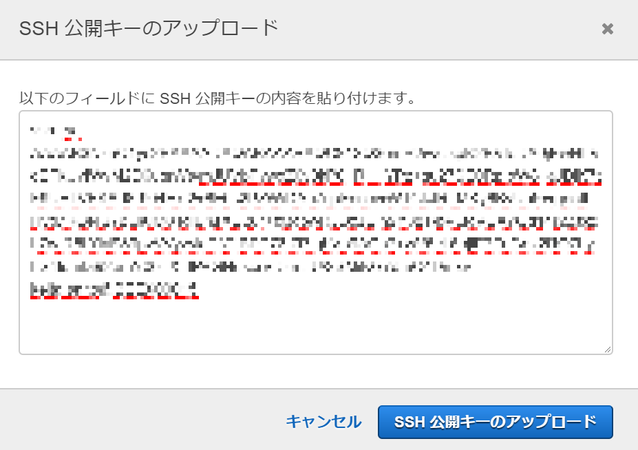
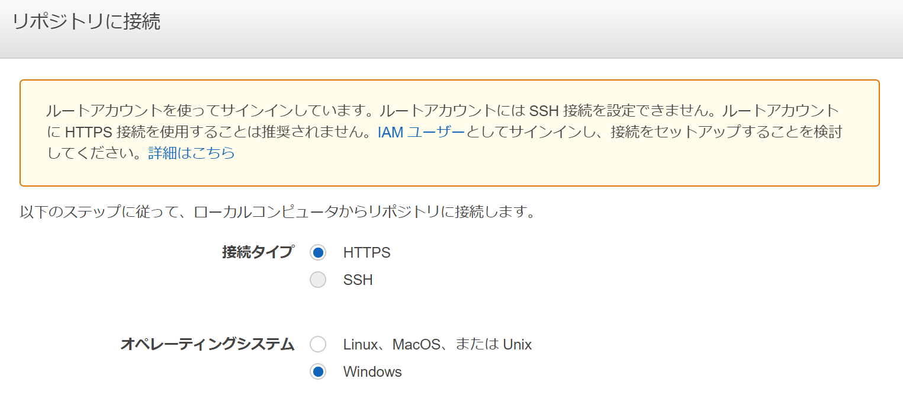

# 🔰AWS CodeCommitを触ってみる

- なんかちょこっと手軽にプライベートなリポジトリが欲しい。
- githubに月額払うまでもない感じで本当に手軽に。
- AWSアカウントを持っている。

という時にAWS CodeCommitはどうだろうかと利用してみた。

## 🔰CodeCommitの料金

- [料金　AWS CodeCommit](https://aws.amazon.com/jp/codecommit/pricing/)

※2017年08月02日の料金表は下記の様子
一人でさっくりと使う分には無料分の範囲で十分収まるかと思われる。


## 🔰今回利用した環境

- git version 2.13.0.windows.1
- windows10
- コンソールはPowershellを使用
- CodeCommitへの接続方法はSSH

余談ですが、Powershellからgitを使う場合は。

- [Posh-Git](https://github.com/dahlbyk/posh-git)

を利用すると便利でいいと思います。

## 🔰公式ドキュメント

- [AWS CodeCommit ドキュメント](https://aws.amazon.com/jp/documentation/codecommit/)

## 🔰事前準備

- [Git 認証情報を使用する HTTPS ユーザー用のセットアップ](http://docs.aws.amazon.com/ja_jp/codecommit/latest/userguide/setting-up-gc.html)

上記ドキュメント等を参考に作業。

IAMコンソールからCodeCommit用のユーザの追加。


今回はcode.commitというユーザを作成。


AWS CodeCommitにアクセスするための権限を付与するが、git認証を使用する場合とSSHを使用する場合で必要な権限は異なる。

本資料ではSSHでCodeCommitに接続する場合のポリシーを選択している。

既存のポリシー

- AWSCodeCommitFullAccess
- IAMUserSSHKeys
- IAMReadOnlyAccess

を選択して次のステップ。


確認画面。ユーザの作成


セキュリティ認証情報が取得できるので大切に扱う！


## 🔰gitのインストール

- [git](https://git-scm.com/)
- [chocolatey - git](https://chocolatey.org/packages/git)

公式サイトやchocolatey等々お好きな方法でインストールして下さい。

## 🔰SSHキーの生成

windowsの環境でてっとり速く作るには先程インストールしたgitにお誂え向きのssh-keygen.exeとかいうのが付属（`インストールしたとこ\Git\usr\bin\ssh-keygen.exe`）している。

まずはSSHキーを格納するディレクトリをユーザフォルダの直下に.sshという名前で作成する。

```Powershell
#ユーザフォルダ直下に.sshディレクトリを作成
#ここにsshのキーやらを設定やらを放り込んでいく
New-Item -ItemType Directory -Path (Join-Path -Path (Get-ChildItem env:USERPROFILE).value -ChildPath ".ssh" )
```

ssh-keygen.exeを引数を付けて実行する。

AWSのドキュメントに

>パブリック/プライベートのキーペアは、OpenSSH 形式の SSH-2 RSA でなければならず、2048 ビットを含む必要があります

とあるので引数は　-t rsa -b 2048。

```Powershell
# &はcall operatorの意味
# &　パス　でssh-keygen.exeを実行 引数は -t rsa -b 2048
& 'C:\Program Files\Git\usr\bin\ssh-keygen.exe'　-t rsa -b 2048
```

実行すると、ファイルを格納するディレクトリとキーフレーズを聞いてくるので入力する。
キーフレーズは後々使用するのでちゃんと覚えておくこと！

なおパスフレーズなしにしたい時は入力しない。


秘密鍵と公開鍵が指定したディレクトリに作成されている。

## 🔰SSH公開キーのアップロード

- [AWS CLI を使用していない SSH ユーザーの セットアップ](http://docs.aws.amazon.com/ja_jp/codecommit/latest/userguide/setting-up-without-cli.html)

IAMユーザで作成したユーザの認証タブにあるSSH公開キーのアップロード。


ポップアップが出てくるのでSSHの公開キーを入力。


適当なエディタで公開鍵のファイルを開いて内容をコピーしてAWSコンソールにペーストしてSSH　公開キーのアップロード。



追加されました。


### 🔰SSH 設定に AWS CodeCommit を追加する


- [ステップ 2: SSH 設定に AWS CodeCommit を追加する](http://docs.aws.amazon.com/ja_jp/codecommit/latest/userguide/setting-up-without-cli.html)

を参考に、ユーザフォルダの直下に作成した.sshディレクトリにconfigファイルを作成する。


## 🔰CodeCommitでリポジトリの作成

CodeCommitを使えるリージョンを選択。
今回は東京リージョンにしてみた。（2017年5月25日から使えるようになった）

CodeCommitのページで **今すぐ始める**

リポジトリ名と説明を入力して **リポジトリの作成**


空のリポジトリができた。


## 🔰CodeCommitのリポジトリに接続

CodeCommitでリポジトリを作ると下記のようなページが表示されます。（もしくはリポジトリの接続ボタンを押すと表示される）
本資料ではSSHで接続するので接続タイプにSSHを選ぶと、前提条件だったり説明が表示されます。


ちなみにルートアカウントでリポジトリにアクセスすると下記のように警告がでたりします。
適当なIAMユーザを作成して作業しましょう。（今回code.commitを作成して利用してるように）



## 🔰CodeCommitのリポジトリをクローン

リポジトリに接続で　**ローカルコンピュータにリポジトリのクローンを作成し、コードでの作業を開始します。**　に表示されていたコードををコピーして実行。

接続してもいいかと来てくるのでyes。

パスフレーズを聞いてくるので入力。


ディレクトリができた。


なお、公式ドキュメントのここらへんが参考になります。

- [ステップ 5: AWS CodeCommit リポジトリを共有し、別のコミットをプッシュしてプルする](http://docs.aws.amazon.com/ja_jp/codecommit/latest/userguide/getting-started.html#getting-started-pull-commits)

## 🔰gitの初期設定

リポジトリを誰がコミットしたか識別しやすいようにユーザ名とメールを設定に登録。

```Powershell
git config --local user.name "other-user-name"
git config --local user.email other-email-address
```

## 🔰適当に開発


とりえあずcloneして出来たディレクトリで開発作業のてい。

helloworld.ps1というファイルを作成。中身はhelloWorldを表示するスクリプト。

```Powershell
write-host "helloWorld"
```

addしてstatsuで確認してcommitしてpushするとパスフレーズを入れろと言われるので入力。

```Powershell
#git add で作成したhelloworld.ps1を追加
git add *

#git statusで確認
git status

#git commitでコミット
git commit -m firstCommit

#git pushでpush
git push
```


## 🔰CodeCommitにpushされた！


## 所感

AWSアカウントを持っている人でお手軽にプライベートリポジトリがちょっと使いたい場合とてもよい。
一人でちょいと使う場合には十分、無料枠内で使えると思えますし。
